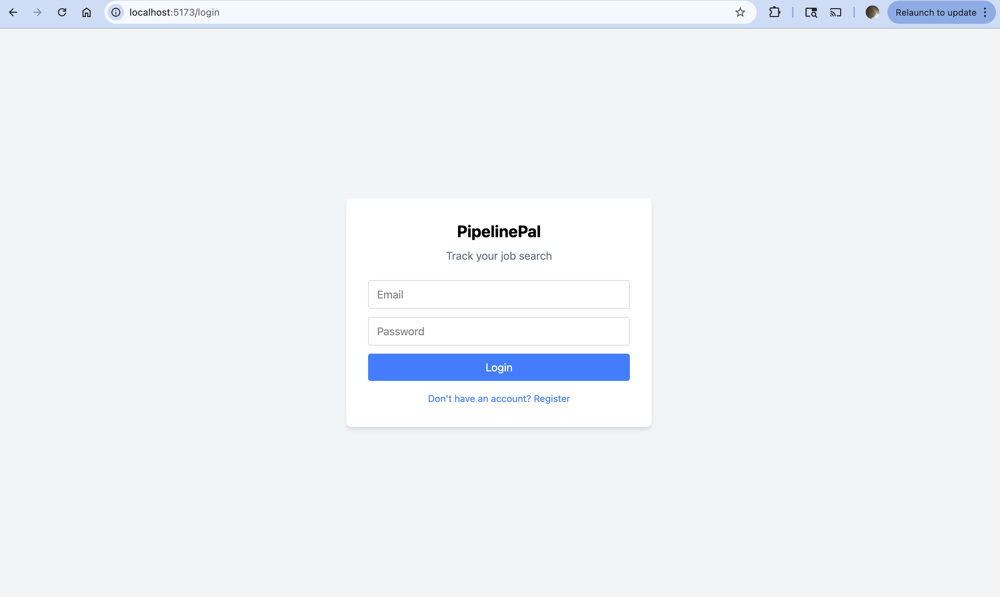
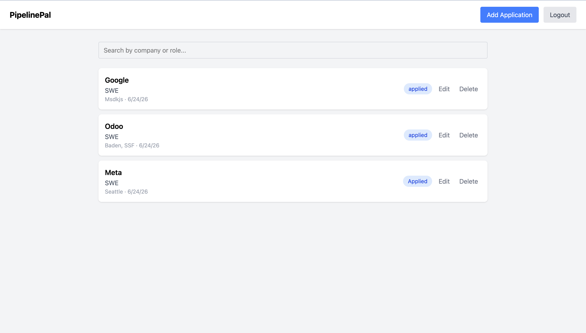
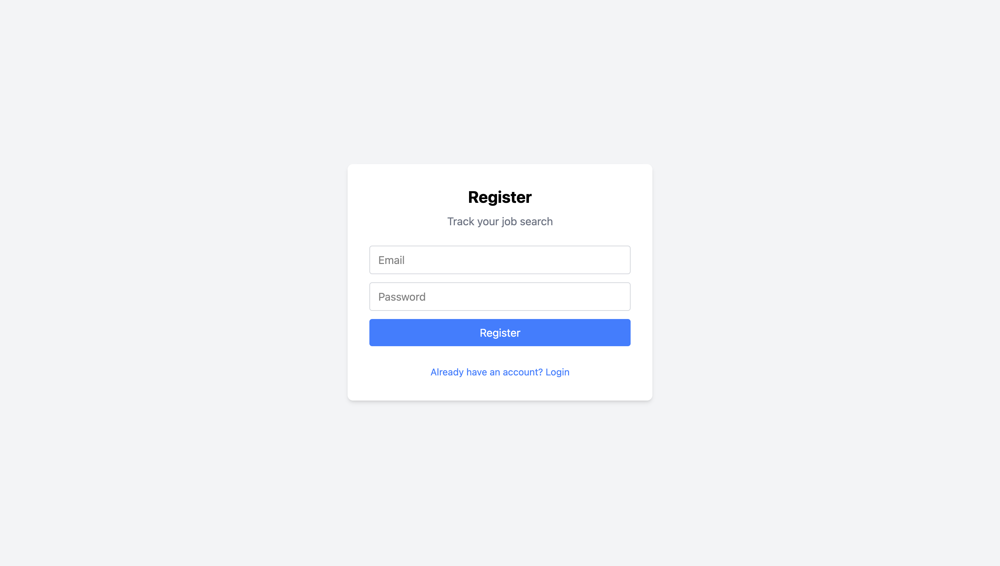

# PipelinePal


A full-stack job application tracker built with Flask and React. Track your applications, update statuses, and search your pipeline — all in one place.

## Live Demo

- **App:** https://pipeline-pal-bice.vercel.app
- **API:** https://pipelinepal-backend.onrender.com

## Screenshots





## Tech Stack

**Backend**
- Python / Flask (application factory pattern)
- SQLAlchemy + SQLite (PostgreSQL-ready)
- Marshmallow for serialization
- Flask-JWT-Extended for authentication
- Flask-CORS

**Frontend**
- React + TypeScript
- Vite
- Tailwind CSS
- Axios

## Features

- User registration and login with JWT authentication
- Protected routes on both frontend and backend
- Add, edit, delete, and search job applications
- Per-user data isolation — users only see their own applications
- Automatic logout on token expiry
- Loading, empty, and error states
- Responsive design

## Running Locally

### Backend

```bash
# Create and activate virtual environment
python -m venv venv
source venv/bin/activate

# Install dependencies
pip install -r requirements.txt

# Run the development server
python run.py
```

The Flask API will be available at `http://127.0.0.1:5001`.

### Frontend

```bash
cd frontend
npm install
npm run dev
```

The React app will be available at `http://localhost:5173`.

### Database Setup

```bash
flask --app run shell
```

```python
from app.extensions import db
db.create_all()
exit()
```

## Testing

The backend has a pytest suite covering authentication and job application CRUD, including per-user authorization checks (one user can't read/edit/delete another user's applications).

```bash
source venv/bin/activate
pytest
```

Tests run against an in-memory SQLite database via a shared `client` fixture, so they never touch your local `pipelinepal.db`. GitHub Actions runs the full suite automatically on every push and pull request to `main` (see the badge at the top of this README).

## Project Structure

```
PipelinePal/
├── .github/
│   └── workflows/
│       └── backend-tests.yml  # CI: runs pytest on push/PR
├── app/
│   ├── __init__.py        # Application factory
│   ├── extensions.py      # Flask extensions
│   ├── models.py          # SQLAlchemy models
│   ├── schemas.py         # Marshmallow schemas
│   └── routes/
│       ├── auth.py        # Register and login endpoints
│       └── applications.py # CRUD endpoints
├── frontend/
│   └── src/
│       ├── components/
│       │   ├── Login.tsx
│       │   ├── Register.tsx
│       │   ├── Dashboard.tsx
│       │   └── ProtectedRoute.tsx
│       ├── api.ts         # Axios instance with interceptors
│       └── App.tsx        # Router setup
├── tests/
│   ├── conftest.py        # Shared fixtures (client, auth_headers)
│   ├── test_auth.py       # Register/login tests
│   └── test_applications.py # CRUD + authorization tests
└── run.py
```
